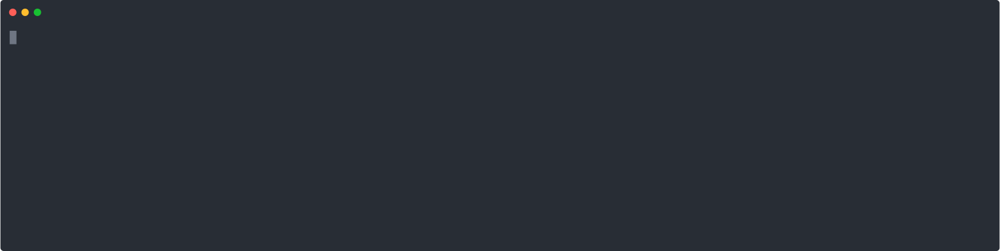

[comment]: # "Редактируйте файл README.source.md"

[](https://gitter.im/Discours/community?utm_source=badge&utm_medium=badge&utm_campaign=pr-badge)
[](https://app.netlify.com/sites/beta-discours-io/deploys)
{"gitdown": "badge", "name": "travis"}
{"gitdown": "badge", "name": "coveralls"}
{"gitdown": "badge", "name": "codeclimate-gpa"}

> Весь фронтэнд Дискурса в одном репозитории!

[Дискурс](https://discours.io) (Пока что на старом проекте) | [Бэта Дискурс](https://beta.discours.io) (собирается из develop) | [Сторибук Дискурса](https://storybook.discours.io)

{"gitdown": "contents"}

### Cheat Sheet

> Быстрый справочник по разработке проекта

- Проект должен запускаться в IE9 и выше, но заботимся о поддержке Edge и выше. [Подробнее](#browser-support).
- `npm run commit` вместо `git commit` (Выводит интерактивный промпт для коммита). [Подробнее](#npm-run-commit).
- PR в ветку `develop` из веток `feature/#id` или `bugfix/#id`. [Подробнее](#git-flow).
- [storybook](https://storybook.js.org) для верстки компонентов и страниц очень помогает.
- [react-testing-library](https://testing-library.com/react) для интеграционного тестирования компонентов (если там есть какая-то логика) для полной уверенности в своём коде.
- [lioness](https://github.com/alexanderwallin/lioness) для i18n, короче говоря, пишем весь текст через тэг `<T />`.
- UI Kit компоненты в `src/components/discours-ui-kit`, вёрстка — в `src/components/modules`, логика — в `src/containers`. [Подробнее](./src/components/README.md).
- Свойства `.css` [идеоматически сортируются](https://github.com/necolas/idiomatic-css#declaration-order) перед коммитом. [Зачем?](https://dev.to/thekashey/happy-potter-and-the-order-of-css-5ec)

> [Оригинал](https://github.com/Discours/discours-welcome)

:[Манифест](https://raw.githubusercontent.com/Discours/discours-welcome/master/MANIFEST.md)

### Storybook

This repo includes [Storybook](https://storybook.js.org/) - a great way to develop components. [Try a tutorial](https://www.learnstorybook.com/) to get started, if you are not familiar with this instrument.

### Component Testing

[react-testing-library](https://github.com/kentcdodds/react-testing-library) is used to write integration tests of React components. [jest-dom](https://github.com/gnapse/jest-dom#readme) is used to have better development experience to write expectations.

If you need any inspiration on how to write tests with different libraries from react world (`react-redux`, `react-router`) you can always look at [Examples](https://github.com/kentcdodds/react-testing-library#examples) and [official documentation](https://testing-library.com/docs/intro).

<a name="browser-support"></a>

### Поддержка браузеров

**Статистика Дискурса взята за январь-июль 2019**

- Edge **0.96%**
- IE **0.73%**
  - IE11 **0.67%**
  - IE8 **0.04%**
  - IE10 **0.0074%**
  - IE9 **0.002%**
  - IE7 **0.001%**
  - IE6 **0.0007%**

Следим за правильным отображением и работой мы в браузере Edge и выше. То есть в Edge должен работать весь функционал сайта и отображаться он должен правильно.

React поддерживает IE9 и мы не видим причин не сделать так, чтобы сайт хотя бы запускался в этом браузере. Понятное дело, верстка будет сильно ехать, но информация будет доступной. Так же некоторые функции будут недоступны.

Например, у нас есть темы, и мы решили их писать используя [css custom properties](https://developer.mozilla.org/en-US/docs/Web/CSS/--*). Этот станадарт поддерживается в браузере Edge и выше. Но вот проблема: если браузер не поддерживает данную спецификацию (IE11 и ниже), сайт не будет отображаться совсем, ибо все цвета находятся в файле темы. Поэтому мы реализовали fallback — [плагин postcss custom properties](https://github.com/postcss/postcss-custom-properties) добавляет перед каждым свойством, где используется переменная, такое же свойство с записанным дефолтным значением этого поля:

```css
.foo {
  color: var(--color-text);
}
```

Он превращает в

```css
.foo {
  color: #000;
  color: var(--color-text);
}
```

Таким образом, переключение тем не будет работать в IE11, но сайт будет отображаться хорошо.

### npm run commit



В проекте есть специальный commit prompt, который помогает отформатировать commit message в соответствии с [Conventional Commits](https://www.conventionalcommits.org/ru/v1.0.0-beta.4/). Для его запуска необходимо выполнить `npm run commit`. Он спросит про тип коммита, scope (не обязательно), описание коммита (мы используем present simple в описании, напр. "Create the Button component"), а в конце попробует достать номер issue на GitHub из имени ветки автоматически и добавить его в commit message в следующем формате: `[#10]`. Таким образом создастся ссылка из коммита на issue.

Что такое **scope**? Это объект изменения кода. Если мы пишем commit message без scope, мы часто пишем **.. in something** в конце. Вот этот **something** и есть scope, который выносится в начало коммит сообщения. То есть `Add onPress event handler in Button component` превратится в `feat(Button component): ✨ Add onPress event handler`. **scope** не обязательный, но желательный параметр.

Использования скрипта `npm run commit` необязательно, но тогда надо писать коммит сообщение в соответствии с [Conventional Commits](https://www.conventionalcommits.org/ru/v1.0.0-beta.4/) самому (эмодзи не обязательны).

### Git flow

Для работы в репозитории мы используем [Git flow](https://danielkummer.github.io/git-flow-cheatsheet/index.ru_RU.html).

- `master` — текущая production версия
- `develop` — текущая beta версия

Перед началом работы нужно создать новую ветку из develop:

- `feature/#10` — новый функционал, описанный в GitHub Issue #10
- `bugfix/#10` — баг фикс, описанный в GitHub Issue #10

Лучше использовать номер тикета в названии ветки, чтобы [коммит скрипт](#commit-flow) добавлял этот номер в коммит автоматически.
