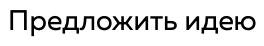

Кнопка (а так же ссылка)

- Если получает параметр `to` - становится ссылкой (`<a>` элемент).
- Если нет - становится кнопкой (`<button>`).

Визуально различий кнопки от ссылки нет — любое визуальное отображение этого компонента может быть как кнопкой, так и ссылкой.

Данный компонент не берёт на себя ответственность за типографику. То есть, если нам нужна ссылка стиля `link-background` с наклонным шрифтом, мы используем

```typescript
<Button variant="link-background">
  <Typography variant="italics">Текст</Typography>
</Button>
```

Компонент `Button` без `Typography` _не используется_!

### Стили кнопок

- `link-regular` (при наведении выглядит как link-underline)




_наведение_

- `link-regular-fat` (такая же, только с более жирным выделением)


_наведение_

- `link-regular inverse` (такая же, но с тегом `inverse`)


_наведение_

- `link-underline` (имеет анимацию появления фона с низу наверх)


_наведение_

- `link-background`


_наведение_

- `link-background inverse` (такая же, но с тегом `inverse`)


_наведение_

- `button-regular`


_наведение_

- `button-primary` (не плохо было бы сделать стиль при наведении)


- `button-fat`


_наведение_

- `button-corner` (не плохо было бы сделать стиль при наведении)


- `button-corner-left`


_наведение_

- `button-corner-right` (при наведении ведет себя как `button-corner-left`)


